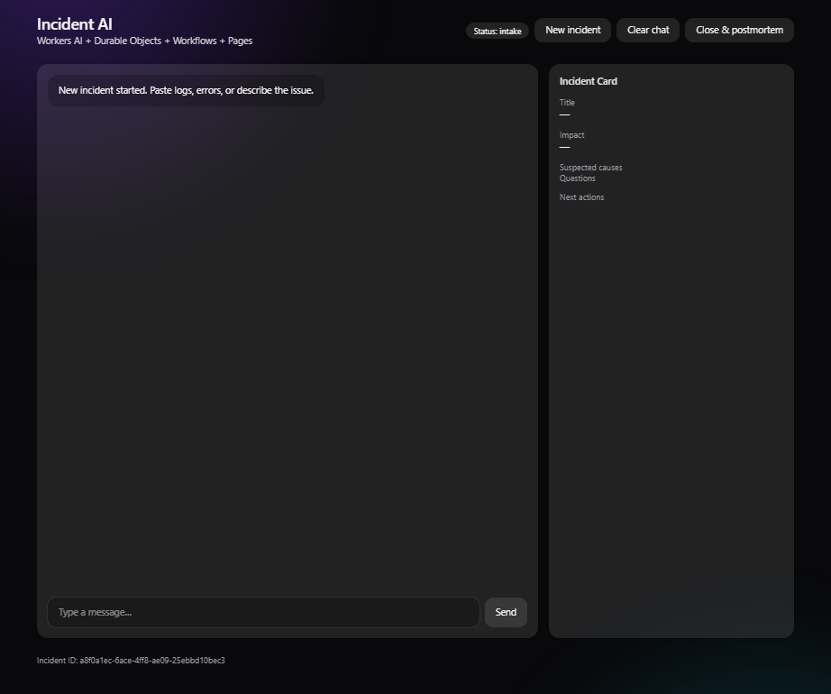
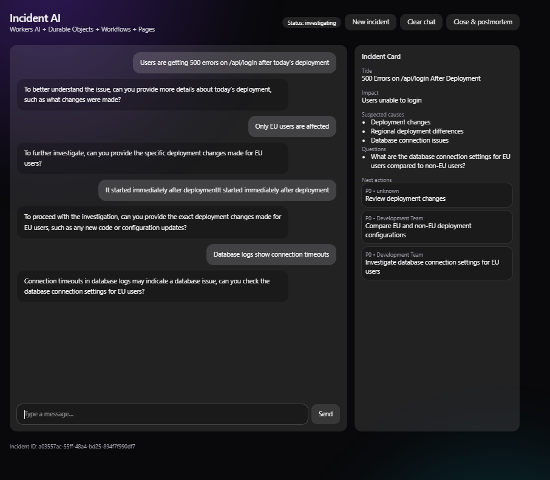
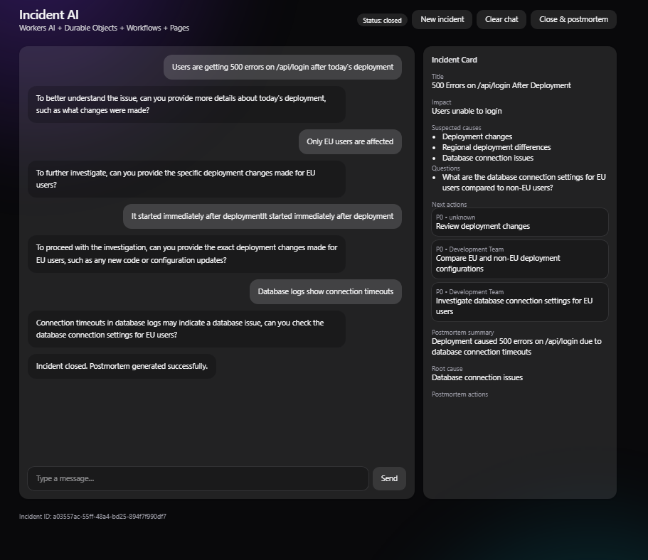

# Incident AI 🚨

An AI-powered incident response assistant built on Cloudflare.

This application helps engineers triage production incidents, maintain structured state, and automatically generate postmortems using an LLM.

---

## ✨ Features

- 💬 **AI Incident Triage**
  - Guides debugging with targeted questions
  - Suggests actionable next steps
  - Avoids repeating already known information

- 🧠 **Stateful Memory**
  - Uses Durable Objects to persist incident state
  - Tracks messages, summary, causes, and investigation progress

- ⚙️ **Automated Postmortems**
  - Cloudflare Workflows generate postmortems on incident close
  - Extracts summary, root cause, and action items

- 🧾 **Structured Incident View**
  - Real-time incident card with:
    - Impact
    - Suspected causes
    - Timeline
    - Questions
    - Next actions

---

## 🏗️ Architecture

This project is built entirely on the Cloudflare developer platform:

- **Workers** → API layer
- **Durable Objects** → stateful incident memory
- **Workflows** → asynchronous postmortem generation
- **Workers AI (Llama 3.3)** → LLM reasoning
- **Pages (React + Tailwind)** → frontend UI

---

## ✅ Assignment Requirements Mapping

| Requirement | Implementation |
| --- | --- |
| LLM | Workers AI using Llama 3.3 |
| Workflow / Coordination | Cloudflare Workflows + Durable Objects |
| User Input (Chat) | React chat interface (Cloudflare Pages) |
| Memory / State | Durable Object storing evolving incident state |

---

## 🧠 How it works

1. A user creates an incident and begins chatting
2. The LLM:
   - asks clarifying questions
   - updates structured incident state
3. State is stored in a Durable Object
4. When the incident is closed:
   - a Workflow generates a postmortem
   - the result is stored and displayed in the UI

---

## 📸 Screenshots

### Incident Triage


### Incident State


### Postmortem


---

## 🛠️ Setup

### Prerequisites

- Node.js (v18+)
- npm
- Cloudflare account
- Wrangler CLI

Install Wrangler:

```bash
npm install -g wrangler
```

Login to Cloudflare:

```bash
wrangler login
```

### Install dependencies

```bash
npm install
```

### Run backend (Workers)

```bash
cd apps/api
npx wrangler dev
```

### Run frontend

```bash
cd apps/web
npm install
npm run dev
```

### Open the app

`http://localhost:5173`

---

## ⚠️ Notes

- LLM responses may occasionally return incomplete JSON
- The system includes fallback handling to ensure stability
- Postmortem generation is asynchronous (via Workflows)
- This project requires Cloudflare authentication via Wrangler to run locally

---

## 🎯 Why this project

This project demonstrates:

- Building **stateful AI applications**
- Designing **LLM + workflow-based systems**
- Handling **real-world AI limitations (invalid outputs)**
- Using the **Cloudflare platform end-to-end**

---

## 👨‍💻 Author

Juan Morales  
Computer Science Student @ University of Surrey

---